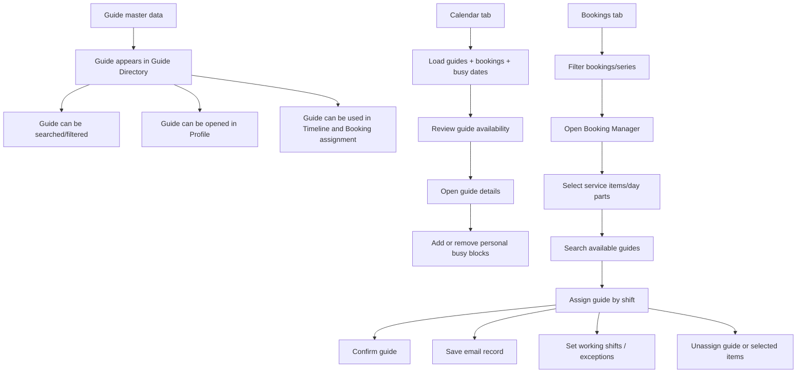

# Guide Management Module Workflow

## 1. Scope

Tai lieu nay mo ta workflow cho module Guide Management hien co trong repo, dua tren cac man hinh va API dang ton tai:

- `Guides`: danh sach guide, profile, tao moi, chinh sua
- `Timeline - Calendar`: xem lich guide, xem booking dang gan vao guide, quan ly busy date
- `Timeline - Bookings`: quan ly booking theo series, mo Booking Manager, assign/unassign/confirm guide
- `Service Guide Assignments API`: luong assign guide theo service/day-part o backend

## 2. Entry Points

### Frontend routes

- `/timeline?tab=calendar`
- `/timeline?tab=bookings`
- `/guides`
- `/guides/new`
- `/guides/:id`
- `/guides/:id/edit`

### Main backend APIs

- `GET /api/guides`
- `GET /api/guides/{id}`
- `POST /api/guides`
- `PUT /api/guides/{id}`
- `GET /api/guides/meta/tags`
- `GET /api/guides/meta/cities`
- `GET /api/guides/meta/countries`
- `GET /api/timeline`
- `POST /api/timeline/booking-guide-confirmation`
- `POST /api/timeline/guide-busy-dates`
- `DELETE /api/timeline/guide-busy-dates/{guideId}/{busyDateId}`
- `POST /api/timeline/booking-item-time-slot`
- `POST /api/timeline/assign-booking-items`
- `POST /api/timeline/unassign-booking-items`
- `DELETE /api/timeline/bookings/{bookingId}/guides/{guideName}`
- `POST /api/timeline/guide-email-record`
- `GET /api/timeline/guide-booking-shifts/{bookingId}/{guideId}`
- `POST /api/timeline/guide-booking-shifts`
- `POST /api/timeline/guide-time-exceptions`
- `GET /api/bookings`
- `GET /api/bookings/{bookingRef}/manager`
- `GET /api/service-guide-assignments/available-guides`
- `POST /api/service-guide-assignments/available-guides/search`
- `POST /api/service-guide-assignments`
- `POST /api/service-guide-assignments/batch`
- `POST /api/service-guide-assignments/confirm`
- `DELETE /api/service-guide-assignments/{resHolidayId}/guides/{guideId}`
- `DELETE /api/service-guide-assignments/guides/{guideId}/batch`
- `POST /api/service-guide-assignments/busy-personal`

## 3. End-to-End Workflow Overview

## 4. Detailed Workflow

### 4.1 Guide master data management

1. User vao `Guides`.
2. He thong load danh sach guide va danh muc client tags.
3. User loc theo:
   - ten guide
   - status `All / Active / Inactive`
   - client tags
4. User chon:
   - `Profile` de xem chi tiet
   - `Schedule` de mo lich cua guide trong `Calendar`
   - `Add New Guide` de tao moi
5. Trong form `Add/Edit Guide`, user nhap:
   - thong tin co ban
   - city/country
   - work type
   - employment/tax/bank info
   - languages
   - client tags
   - biography/notes
6. User bam `Save Guide`.
7. He thong:
   - `POST /api/guides` neu tao moi
   - `PUT /api/guides/{id}` neu cap nhat
8. Sau khi save thanh cong, user quay ve `Guides` va guide moi/cap nhat duoc hien thi trong danh sach.

### 4.2 Guide profile review

1. User mo `Profile` tu danh sach guide.
2. He thong load:
   - thong tin ca nhan
   - ngon ngu
   - certifications
   - notes
   - thong tin tai chinh
   - thong ke guide
3. User co the bam `Edit Profile` de chuyen sang luong cap nhat.

### 4.3 Calendar workflow

1. User vao `Timeline` tab `Calendar`.
2. He thong load timeline data theo bo loc:
   - from/to date
   - country
   - search keyword
   - client
   - guide
   - series mode
3. User xem availability cua tung guide tren truc thoi gian.
4. User co the double-click guide row de mo man hinh chi tiet guide/busy dates.
5. Trong guide details:
   - xem tong so accepted bookings
   - xem so busy blocks
   - xem booking trong nam dang chon
6. Trong `Busy Dates Management`, user co the:
   - them busy period (`from`, `to`, `shift`)
   - xoa busy period
7. He thong validate tren UI:
   - khong cho tao busy block bi overlap voi busy block da co
   - khong cho tao busy block neu guide dang on-tour trong khoang do
8. Backend luu vao timeline repository va tra ve timeline data moi de refresh UI.

### 4.4 Bookings workflow

1. User vao `Timeline` tab `Bookings`.
2. He thong load danh sach booking va booking series theo bo loc:
   - date range
   - search
   - client
   - country
   - guide
   - series mode
3. User co the mo them booking trong tung series qua `load more`.
4. User bam `Manage Booking` de mo `Booking Manager`.

### 4.5 Booking Manager workflow

1. Khi mo `Booking Manager`, he thong load:
   - chi tiet service/day-part cua booking
   - item assignments
   - item time slots
   - guide statuses
   - email records
2. User chon 1 hoac nhieu service items can assign.
3. User bam `Assign Guide`.
4. He thong search guide phu hop dua tren:
   - selected services
   - arr date
   - shift/time slot
   - busy status hien tai
5. Neu guide free ca ngay, he thong cho phep `ALL` mac dinh.
6. Neu guide chi ranh mot phan, user phai chon shift hop le.
7. User bam `Confirm Assignment`.
8. He thong goi luong assign theo batch service, tao assignment va busy rows lien quan.
9. Sau khi assign, booking manager refresh de hien:
   - currently assigned guides
   - guide status
   - grouping theo ngay va theo guide

### 4.6 Confirm guide workflow

1. Sau khi guide da duoc assign, user bam `Confirm`.
2. He thong cap nhat status guide trong booking thanh `confirmed`.
3. Danh sach `confirmedGuides` va count tren UI duoc refresh.

### 4.7 Email record workflow

1. Trong `Currently Assigned`, user bam `Email`.
2. He thong mo email composer voi:
   - date
   - subject
   - body
   - last action neu da co record truoc do
3. User chon:
   - `Save Draft`
   - `Send Email`
4. He thong luu email record vao backend va refresh booking/timeline data.

### 4.8 Guide shift and exception workflow

1. Trong `Currently Assigned`, user bam vao icon chinh shift cua guide.
2. He thong load shifts da luu cua guide theo `bookingId + guideId`.
3. User cap nhat shift tung ngay.
4. User bam save, he thong cap nhat cac record `M_GuideBusy` phu hop.
5. Neu khong tim thay busy record khop ngay duoc chon, backend tra loi loi nghiep vu.
6. He thong cung ho tro luong `guide-time-exceptions` de ghi nhan ngoai le theo booking/ngay.

### 4.9 Unassign workflow

Co 2 cach unassign:

1. Unassign toan bo guide khoi booking:
   - user bam `Unassign` tai guide da assign
   - confirm dialog hien thi
   - he thong xoa assign/busy records lien quan
2. Unassign mot nhom selected items:
   - user select cac item dang cung thuoc 1 guide
   - bam `Unassign`
   - he thong goi batch unassign cho cac service ids duoc chon

## 5. Core Business Rules

- Guide phai ton tai truoc khi duoc assign vao booking/service.
- `AssignedBy` va `GuideId` phai hop le khi assign.
- Khong duoc assign khi guide da busy cung ngay/cung shift.
- Neu `MaCa = ALL`, backend co the expand thanh nhieu concrete shifts.
- Shift code phai nam trong tap gia tri hop le.
- Busy date/guide shift phu thuoc vao viec bang `M_GuideBusy` da co cot `Shift`.
- Confirm guide la buoc rieng, tach voi assign.
- Email record la thong tin ho tro van hanh, khong thay the assignment status.
- Unassign theo selected items chi dung khi cac item dang thuoc cung 1 guide.

## 6. Roles Involved

- Operation/Admin: tao guide, cap nhat profile, quan ly tags
- Dispatcher/Coordinator: xem availability, assign guide, confirm guide
- Booking operator: cap nhat time slot, email record, exception, unassign khi can

## 7. Suggested Test Data

- It nhat 3 guides:
  - 1 guide full free
  - 1 guide dang busy mot so shifts
  - 1 guide dang assigned booking khac
- It nhat 2 bookings:
  - 1 booking co nhieu day parts va nhieu ngay
  - 1 booking cung ngay de tao conflict
- It nhat 1 guide co san busy date ca ngay
- It nhat 1 guide co email record da luu

## 8. Known Gaps / Notes

- Sidebar co item `Tours & Bookings` tron route `/tours`, nhung route nay chua duoc khai bao trong `routes.tsx`.
- UAT nen tap trung vao cac luong dang co that tren UI va API o tren, khong mo rong sang man hinh chua ton tai.
- Timeline page hien dang la man trung tam cua module, gom ca calendar view va booking manager workflow.
